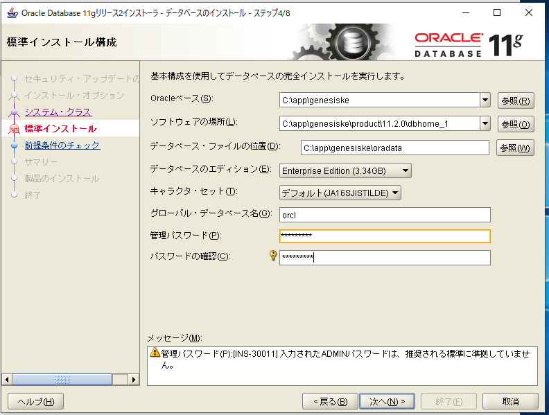
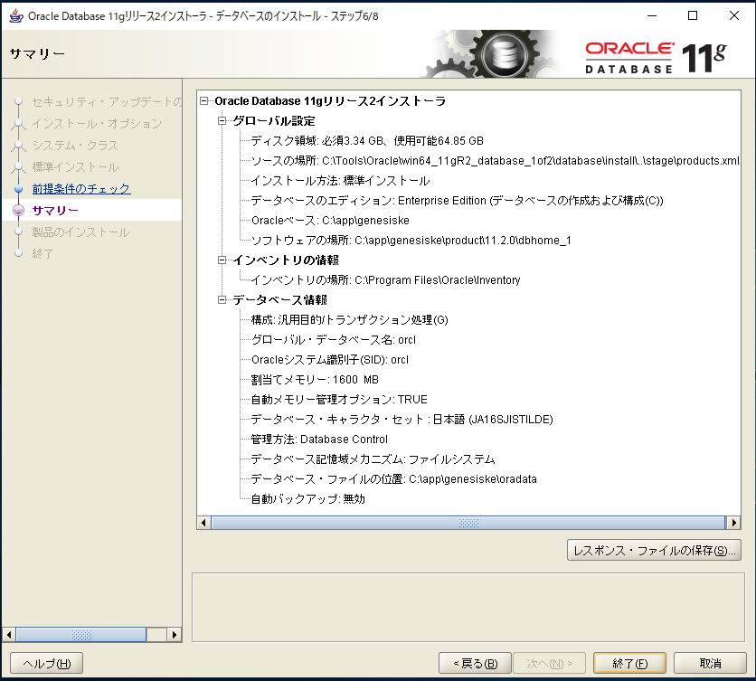
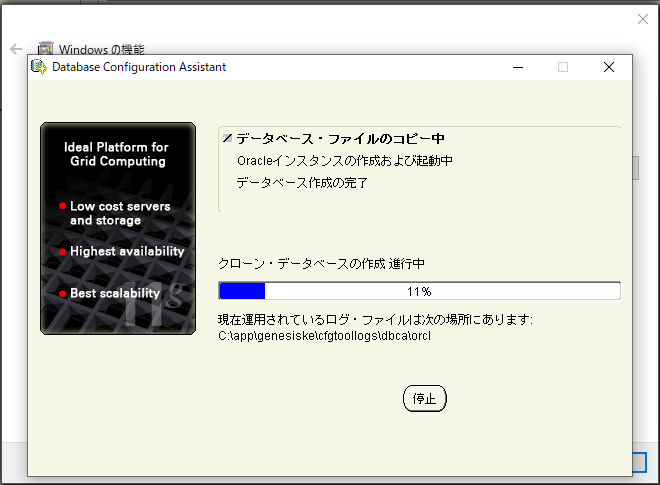

# Oracle Database 11gR2 をインストールした

## 環境
Windows 10 on Mac Bootcamp

## インストール作業
[この記事を参考に進めた](https://www.doraxdora.com/blog/2018/07/10/5180/)
- 記事とちがった点
  - 途中で、。NET 3.5（3.0、2.0含む）の導入を促された
  - NETのインストールを終了するにはPCの再起動が必要
  - 途中でOracleのインストールが中断した格好になってしまったが、sqlplusで接続の確認はできた

## インストール途中のエビデンス
設定が必要だった部分を備忘録として残しておく。

標準インストール構成画面（ステップ4/8）  
以下を設定  
グローバル・データベース名：　orcl  
管理パスワード：　genesiske  


サマリー


Database Configration  


## 確認
sqlplusを通じて接続してみる。  

```Code
$ sqlplus sys/sys@ORCL as sysdba

// 切断は
> Exit
で抜ける。
```

## 参考記事
[Oracle Database Express Edition 11g Release 2 を完全にアンインストールする](https://www.doraxdora.com/blog/2018/07/09/post-5169/)  
