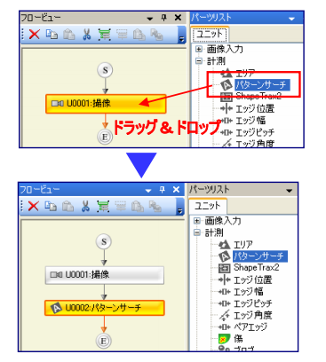
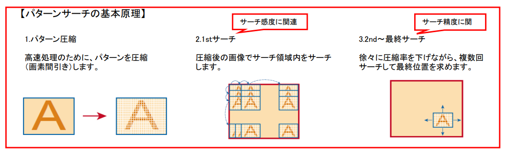
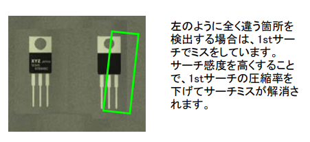
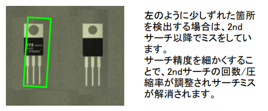

## 位置決め習得コース

### 任意の形状を探す（10級「パターンサーチ」ユニット）
#### パターンサーチ モードを追加する
2-46 p84  
- 画像パターンをあらかじめ登録しておくことで、入力画像の中から登録パターンにもっとも似ている部分を検出して、パターンの位置や傾き角度、相関値を計測できます。  
- ラベルで管理される  
 

「パーツリスト」の「計測」項目より「パターンサーチ」を「撮像」ユニットにドラッグ＆ドロップしてください。  
※ドラッグ＆ドロップしたユニットの下に追加されます。
パターンサーチユニットが開きます。  

以下のステップは、パターンサーチモードの標準的な設定

サーチ探索範囲となるサーチ領域を指定する  
「0：事前準備 Step.3」で作成したShapeTrax2ユニットの【サーチ領域設定】タブをクリックします。【計測領域】で【矩形】を選択し、ビジョンウィンドウ上でマウスで領域を描画します。  

サーチパターン対象となるパターンをパターン領域で指定する  
【パターン領域設定】タブをクリックし、サーチ領域と同様の手順で領域を描画します。  
**※パターン領域を指定する際には、より特徴のある箇所を指定するようにし、かつ無駄な範囲は入れないようにすると、誤検出を防ぎ、より検出精度が向上します。**  

サーチをおこなう角度範囲を指定する  
【検出条件】タブをクリックし、【角度範囲】の値を
±180°の範囲で指定します。  
※角度範囲が広ければ広いほど処理時間はかかります。必要最低限の範囲で指定することがポイントとなります。  

---

### 追えないパターンをサーチする（9級「パターンサーチ」ユニット）
パターンサーチユニットを選択して、ダブルクリック、開く  

ビジョンウィンドウで現状の検出状態を確認する  
文字の無い画像は検出できていないのがわかります。今回はこれも検出できるように設定します。  

相関値下限（検出条件設定）を変更する  
【検出条件】タブを選択し、【相関値下限】のパラ
メータを変更します。  
【相関値下限】とは計測の検出候補とする相関
値の下限を指定するものです。  
今回はより相関値の低いものも検出できるよう「90」から「80」にします。  
※逆に【相関値下限】を「90」に設定すると、相関値が90未満のパターンを計測から排除します。誤検出を防ぎたいときなどに便利です。  

ビジョンウィンドウで検出状態をモニターする  
【相関値下限】を「90」から「80」に変更したので相関値が低い、文字の無いパターンでも検出ができていることを確認します。  

#### 検出レベルの調整をする <サーチ感度／サーチ精度>

サーチ感度を設定する  
**パターンと大きく違う対象をサーチする場合** は、【サーチ感度】を設定します。  
【検出条件】タブを選択し、**【サーチ感度】の数値を上げてください。** また、**処理時間を早くしたい場合は** 、【サーチ感度】の数値を下げてください。  

サーチ精度を設定する  
パターンと近いが若干ずれている場合は、【サーチ精度】を設定します。  
【検出条件】タブを選択し、【サーチ精度】の数値を上げてください。また、処理時間を早くしたい場合は、【サーチ精度】の数値を下げてください。  

---

### 位置ずれを補正する（8級「パターンサーチ」ユニット）
ビジョンウィンドウで現状の検出状態を確認する  
ビジョンウィンドウで検出状況を確認します。「パターンサーチ」と「エッジピッチ」の２つが設定されています。それぞれのユニットをクリックしてから、1回実行ボタンを押すと2枚の画像で検査をしていることが分かります。パターンサーチでは90度傾いたワークでも、その位置に追従して検出していますが、エッジピッチではワークがずれると検査位置が固定で検査ができません。このような場合は、位置補正ユニットを利用し、パターンサーチで検出した位置補正量を、エッジピッチユニットで用いて、位置を追従します。　　

### 他ユニットに位置補正量を与える <位置補正>
位置補正ユニットを追加する  
「パーツリスト」から「位置補正」‐「位置補正」をドラッグし、「フロービュー」の「パターンサーチ」にドロップします。フローに位置補正ユニットが追加されます。  

位置補正ユニットを追加する  
位置補正ユニットのプロパティで「参照先指定」‐「検出位置指定1点目」‐「位置」のプルダウンから「パターンサーチ」を指定します。これで位置補正量を位置補正ユニットが保持をしました。  

位置補正を計測ユニットに割り付ける  
位置補正先となるエッジピッチユニットを開き、「位置補正元ユニットID」のプルダウンで「位置補正」を選択します。  
これで位置補正ユニットの保持する補正量をエッジピッチユニットが受け取れるようになり、位置ズレに追従できるようになります。  

---

### 輪郭サーチを設定する （7級「ShapeTrax2」ユニット）
- 登録された画像パターンと入力画像から得られるエッジ情報を比較することで、最も相似した場所を検出してパターンの位置や傾き角度、相関値を計測できます。  
- 対象の輪郭を主としたエッジ情報を参照する点でパターンサーチ（2-46ページ）と異なり、対象の表面状態変動や欠損に対する精度、安定度を求められる位置検出に適しています。

  

ShapeTrax2 モードを追加する  
設定の基準となる画像を登録します。基準となる画像を【1回実行】ボタンで画面に表示し、「ビジョンウィンドウ」の【画像登録】ボタンを押して画像登録メニューに入り、「登録」ボタンを押してください。「パーツリスト」の「計測」項目より「ShapeTrax2」を「撮像」ユニットにドラッグ＆ドロップしてください。  
※ドラッグ＆ドロップしたユニットの下に追加され
ます。ShapeTrax2ユニットが開きます。  

以下のステップは、ShapeTrax2モードの標準的な設定

サーチ領域を指定する  
サーチ探索範囲となるサーチ領域を指定しま
す。「0：事前準備 Step.3」で作成したShapeTrax2ユニットの【サーチ領域設定】タブをクリックします。【計測領域】で【矩形】を選択し、ビジョンウィンドウ上でマウスで領域を描画します。  

サーチパターン対象となるパターンをパターン領域で指定する  
【パターン領域設定】タブをクリックし、サーチ領域と同様の手順で領域を描画します。  
※パターン領域を指定する際には、より特徴のある箇所を指定するようにし、かつ無駄な範囲は入れないようにすると、誤検出を防ぎ、より検出精度が向上します。  

サーチする角度範囲を指定する  
【検出条件】タブをクリックし、【角度範囲】の値を±180°の範囲で指定します。　　
※角度範囲が広ければ広いほど処理時間はかかりますので、必要最低限の範囲で指定することがポイントとなります。　　

---

### 輪郭を適切に抽出する（6級「パターンサーチ」ユニット）
ShapeTrax2 モードを追加する  

#### 特徴検出条件設定
特徴抽出状態を確認する  
【特徴抽出条件】タブをクリックし、【表示特徴】を変更することで表示を切り替えられます。  
粗特徴と微細特徴の違い  
【粗特徴】とは縮小画像とそのパターンモデルを使用しておおよその位置を検出する粗サーチに用いる特徴のこと、  
【微細特徴】とは粗サーチ後に正確な位置を検出する際に用いる特徴のことです。  

特徴の表示色について  
青【入力特徴】：サーチ領域内で特徴検出条件を満たす特徴点をすべて表示します。入力画像の状態により抽出される特徴点が変わります。  
緑【登録特徴】：登録パターンに対して抽出された特徴点で、この特徴形状をサーチ領域内で探します。  

強度下限を調整する  
【強度下限】を調整することで、検査領域内にあるノイズ成分を、検出対象もしくは登録対象としないようにすることができます。  

サーチ感度を設定する  
【サーチ感度】の「低い」～「高い」とは、粗サーチの画像の縮小度を変更するものです。「低い」では縮小度が高くなる代わりに処理速度が速くなり、「高い」では縮小度が低くなり、処理速度は遅くなりますが、「高い」のほうがサーチしやすくなります。  
緑線で表示されている登録特徴は画像の縮小度により変化するので、【サーチ感度】「高い」では対象の輪郭に近く、「低い」では少し輪郭からずれている事がわかります。  

### 追えない輪郭対象をサーチする（5級「ShapeTrax2」ユニット）
ShapeTrax2 モードを選択する  

#### 検出レベルの調整をする <相関値下限>
ビジョンウィンドウで現状の検出状態を確認する  

相関値下限（検出条件設定）を変更する  
ShapeTrax2ユニットの【検出条件】タブを選択し、【相関値下限】のパラメータを変更します。  
【相関値下限】とは計測の検出候補とする相関値の下限を指定するものです。  
今回はより相関値の低いものも検出できるよう「60」から「10」にします。  
※逆に【相関値下限】を「80」に設定すると、相関値が80未満のパターンを計測から排除するので、誤検出を防ぎたい時などに便利です。  

検出状態をモニターする  
ビジョンウィンドウで検出状況を確認します。  
【相関値下限】を「60」から「10」に変更したので相関値が「15」程度の影のあるパターンでも検出ができていることを確認します。  

---

### 複数／サイズ違いの対象を検出する（4級「ShapeTrax2」ユニット）
ShapeTrax2 モードを選択する  

ビジョンウィンドウで現状の検出状態を確認する  
複数の検出対象があるにもかかわらず、ひとつだけしか検出していない場合  

検出個数の設定を行う  
ShapeTrax2ユニットの【検出条件】タブを選択し、【検出個数】のパラメータを変更します。画像の検出対象の個数にあわせて「55」とします。  

検出状態をモニターする  
ビジョンウィンドウで検出状況を確認します。それぞれの映像に対して、対象の個数分だけ検出できていることがわかります。輪郭サーチのため、一部が欠けている対象に関してもサーチができていることがわかります。  

#### サイズの異なる対象を検出する <スケール範囲>
サーチする対象のサイズが登録したときから変化した場合などに再調整が必要。  

検出スケール範囲の設定を行う  
ShapeTrax2ユニットの【検出条件】タブを選択し、【スケール範囲 上限】を変更します。ここでは登録したパターンに対する、検出対象サイズの比率を指定します。  

検出状態をモニターする  
ビジョンウィンドウで検出状況を確認します。登録パターンに対する検出対象のサイズが変わっても検出できることがわかります。  

---

### 輪郭パターンの変化に対応する（3級「ShapeTrax2」ユニット）
ShapeTrax2 モードを選択する

#### 登録画像に対してコントラストが低くなっても検出する <コントラスト変動>
ビジョンウィンドウで現状の検出状態を確認する  
現状の標準設定のままではコントラストの低い画像は検出できていません。  

コントラスト変動の設定を行う  
ShapeTrax2ユニットの【検出条件】タブを選択し、【縮小度】タブから【コントラスト変動】を「小」から「大」に変更します。  
【コントラスト変動】とは、サーチ対象のコントラストが登録画像に対して変動が大きい場合に設定するとサーチの安定性が向上します。ただし、通常は「小」を選択した方が処理時間が短くなります。  

検出状態をモニターする  
ビジョンウィンドウで検出状況を確認します。登録画像に対してコントラストが低い対象に関しても検出ができていることがわかります。ビジョンウィンドウの【種別】ダイアログより「処理画像1」を選択すると登録エッジパターンが表示されます。  

#### 白黒反転してしまうワークでも影響なく検出する <濃淡反転>
ビジョンウィンドウで現状の検出状態を確認する  
ビジョンウィンドウで検出状況を確認します。白色の十字マークは検出できていますが、標準設定のままでは黒色の十字マークは検出できていません。これはデフォルト設定では登録したワークから濃淡が反転した場合検出しないようになっているためです。  

濃淡反転の設定を行う  
ShapeTrax2ユニットの【検出条件】タブを選択し、【濃淡反転】を「OFF」から「ON」に変更します。  

検出状態をモニターする  
ビジョンウィンドウで検出状況を確認します。【濃淡反転】を「ON」にしたことにより黒色の十字マークも検出していることがわかります。  

---

### 演算を使って位置情報を求める（2級「数値演算」ユニット）
ShapeTrax2 モードを選択する  
フロービューから「ShapeTrax2」ユニットをクリック
してください。  
次にビジョンウインドウの種別で「処理画像2」を選択します。「1回実行」を押して、5枚の画像を確認します。2つのShapeTrax2ユニットで□と十をそれぞれサーチできていることが分かります。今回は□と十の中心位置の距離を数値演算で求めます。  

#### 数値演算で距離を求める <数値演算>
使用するユニットを追加します。
「パーツリスト」の「演算」項目より「数値演算」を「U0003ShapeTrax2」の上にドラッグ＆ドロップします。追加と同時に数値演算ユニットが開きます  

変数を追加する  
「数値演算設定」タブを選択します。
ここで演算結果を格納する変数（スカラ型）を追加します。メニューバーの設定-変数設定を選択します。「追加」を押してスカラ変数「#dist1」(名称は自由)を追加します。  

演算に編巣を追加する  
先程設定したスカラ変数「#dist1」を演算結果を格納する変数として追加します。パーツリストから変数一覧タブを選択し、ローカル変数-「#dist1」を演算式の枠にドラッグ&ドロップします。#distの次に「=」をキーボードから入力します。  

演算関数を追加する  
距離を測定する演算関数「Dist」を追加します。パーツリストから演算式タブを選択し、幾何演算関数-「Dist(Q1,Q2):2点間距離」を演算式の枠にドラッグ&ドロップします。  

検出点（ユニット結果）を追加する  
ShapeTrax2で検出したユニット結果位置座標を追加します。パーツリストから結果データタブを選択し、U0002:ShapeTrax2-結果データ-位置XY-AB絶対計測値を選択し、演算式の枠へドラッグ&ドロップします。同様に、「、」の後ろにはU0003:ShapeTrax2の位置XY絶対計測値「U0003.RSLT.XY[JGL]:AB」を追加します。  

演算式を完成する  
「適用」を押して、演算式エラーが「エラー無し」となることを確認します。次に数値演算ユニットで合否判定するために、判定条件対象となる「ANS」に距離結果を代入します。「ANS=#dist1」と入力します。「1回実行」を押すとそれぞれの画像でのマーク間距離がANSの箇所に表示されます。これを見て、「上限」にチェックをいれ、「10」と入力します。  

---

### 画像の歪み／傾きを補正する（1級「キャリブレーション」ユニット）
ShapeTrax2 モードを選択する  

#### 画像の傾き／歪みを補正する <キャリブレーション>
ビジョンウィンドウで現状の検出状態を確認する  
表示画像で「入力画像」を選択してから、「1回実行」ボタンを押し、ビジョンウィンドウで検出状況を確認します。現状の設定のままでは2枚目以降の画像では検出できていません。斜めに映した場合、キャリブレーションなしではこのような状態になります。  

キャリブレーションユニットを追加する  
使用するユニットを追加します。「パーツリスト」の「演算」項目より「キャリブレーション」を「撮像」の上にドラッグ＆ドロップします。追加と同時にキャリブレーションユニットが開きます。

ティーチングを実行する  
「ティーチング実行」タブを選択します。登録画像101として、チェスボードが表示されます。（今回は事前に登録しています。本来はカメラの傾きに合わせて撮像した画像を使います。）チェスボードの境目にある赤点がティーチング基準点です。「ティーチング実行」を押します。ティーチングが実行され、ステータスが「成功」となれば完了です。  

補正後画像を生成する  
「画像設定」タブを選択します。「補正後画像を生成する」にチェックを入れます。「補正後画像」枠には画像変数を入れるので、画像変数を追加します。  

演算後画像変数を追加する  
メニューバーの「設定」-「変数設定」を選択します。「追加」を押して、対応カメラ「カメラ1」、変数名「&CamOut1」(名称は自由)、演算後画像変数にチェックを入れます。演算後画像変数とは「画像演算」等に使用する変換処理後の画像を入れる変数です。  

補正後画像に画像変数を指定する  
補正後画像に先程追加した演算後画像変数を割り当てます。補正後画像枠を選択し、画像変数の接頭子「&」を入力すると、画像変数候補が表示されます。ここで「&CamOut1」を指定します。  

演算後画像を画像登録する  
ShapeTrax2の基準として、演算後画像を画像登録します。メニューバーの「設定」-「画像登録」を選択し、画像変数で「&CamOut1」を選択します。「登録」を押すと、上書き確認が表示されるので「OK」を押して完了させます。  

ShapeTrax2の画像設定を変更する  
ShapeTrax2の画像をキャリブレーション後の画像に変更します。フローからShapeTrax2を開き（ダブルクリック）します。画像設定タブの「入力画像」でキャリブレーション後画像変数「&CamOut1」を選択します。  

ShapeTrax2の動作を確認する  
キャリブレーションの効果を確認します。表示画像を「入力画像」に変更します。「1回実行」を押すと、4枚の画像でシミュレーション実行されます。4枚の画像全てをサーチできることが確認できたら完了です。  

