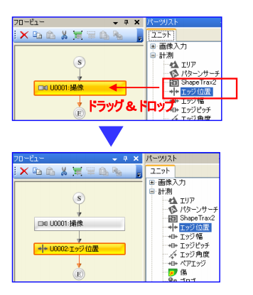
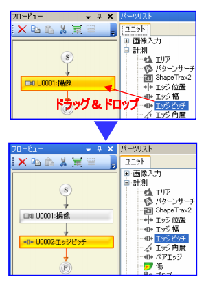
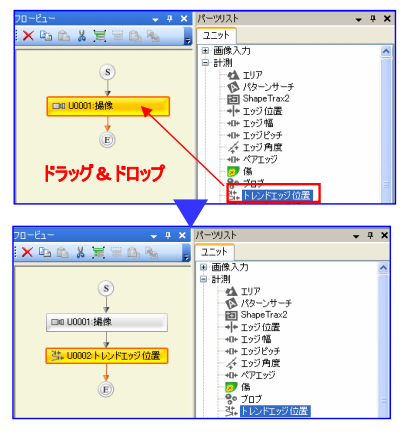
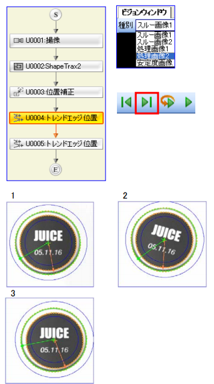
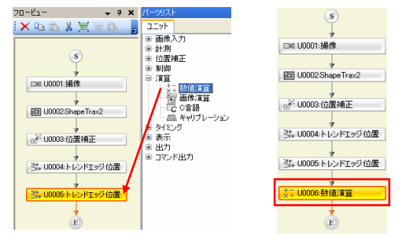

## 寸法測定習得コース

ここでは、以下のパーツの学習結果をまとめる。  
- エッジ位置
- エッジ幅
- エッジピッチ

---

### エッジを検出する（10級「エッジ位置」ユニット）
#### エッジ位置モードの追加
「パーツリスト」の「計測」項目より「エッジ位置」を「撮像」ユニットにドラッグ＆ドロップしてください。※ドラッグ＆ドロップしたユニットの下に追加されます。エッジ位置ユニットが開きます。  

計測領域の指定  
エッジ位置ユニットの【領域設定】タブをクリックします。【計測領域】で【矩形】を選択し、ビジョンウィンドウ上でマウスで領域を描画します。  

検出状態を確認  
エッジ位置ユニットの【検出条件】タブをクリックし、登録画像でのエッジ検出状態と「エッジ強度波形」を確認します。エッジが検出された箇所には、緑色のラインが表示されます。また、計測領域の下には検出方向でのエッジの強さを表す「エッジ強度波形」が表示され、エッジ候補となる箇所が確認できます。  

計測値に対してエッジ位置をNGとする閾値の設定  
【判定条件】メニューに入り、【位置】の【上限】と【下限】に数値を入力します。メニューを開いた時点で【基準】欄には、登録画面に対して現在の設定で検査したときの値が自動的に表示されています。上限値／下限値を設定する際にはこの値を参考にすると便利です。

以上が、エッジ位置モードの標準的な設定の流れ  
以下は、さらに微調整を加える場合。  

---

### 任意方向（上下左右/回転）のエッジを検出する（9級「エッジ位置」ユニット）
#### 標準設定（方向設定項目）
検出方向を決める  
【検出条件】タブを選択し、エッジの【検出方向】を「→」から「↓」に変更します。初期値は左から右「→」となっているので、検査内容に合わせて「→」「←」「↓」「↑」から選択します。（領域が円周/円弧以外の場合）領域が円周か円弧の場合は「時計回り」「反時計回り」から選択します。  

エッジ方向を決める  
【エッジ方向】でエッジの明暗方向を決めます。初期値は「両方」となっているので、検査内容に合わせて「明→暗」「暗→明」「両方」から選択します。右の例であれば、中央の□でエッジ検出をするとき、エッジ方向は「暗→明」を選択します。  
次に【検出方向】で「↑」を選択すると、中央の□の下のエッジを検出します。このように、検出したいエッジの【検出方向】と【エッジ方向】を設定してください。  

#### 標準設定（エッジ開始角度）
状態を確認する  
【検出条件】タブを選択し、エッジの【開始角度】が「0」であると確認します。  

開始角度を設定する  
【開始角度】を30度に変更します。計測領域が円周か円弧のときは、位置（座標）ではなく角度を計測します。右の例は先頭文字の角度を求める用途です。開始角度の初期値が「0」の場合、開始位置は時計でいう3時の位置です。この例では3時の位置には文字がかかっていて、正しく先頭文字を検出できません。このような場合には、開始角度をずらして文字を避けると、その場所からエッジ検出し、先頭文字を見つける事ができます。  

---

### バリを無視して検出したいエッジを指定する（8級「エッジ位置」ユニット）
#### バリを無視して検出したいエッジを指定する <エッジ感度>
現状の設定と状態を確認  
【検出条件】タブを選択し、現状を確認します。今回の目的は四角の左端エッジ検出ですが、ワークにはバリがあり、その先端を検出してしまっています。このときのエッジ強度波形と【エッジ感度】のライン（通常は黄色/エッジ感度選択時はオレンジ）を確認します。  

エッジ感度（％）を変更  
【エッジ感度】を「30」から「60」に変更します。バリを無視して、四角の左端を検出することが確認できます。このときのエッジ強度波形と【エッジ感度】のラインを確認します。【エッジ感度】とは、計測領域内のエッジ強度最大値を100％としたときの、エッジ候補とするエッジ強度を指定するパラメータです。  

エッジ強度波形を見て確認  
【エッジ感度】はエッジモードで最も重要なパラメータですが、これを決めるときには「エッジ強度波形」を見ながら設定することが必要です。エッジ強度波形拡大図では、エッジ感度「30」のとき、バリを検出しますが、「60」にするとバリをキャンセルして四角の左端を検出することがわかります。また、数値の基準「100％」は右端のエッジであることもわかります。  

---

### 弱いノイズおよび強いエッジをカットする（7級「エッジ位置」ユニット）
#### 弱いノイズ及び強いエッジをカットする <エッジ強度下限/上限>
現状の設定と状態を確認  
【検出条件】タブを選択し、現状を確認します。ワークの前にノイズがあり、ノイズでエッジを検出してしまっています。このときのエッジ強度波形と【エッジ強度下限】のライン（通常は緑色/エッジ感度選択時はオレンジ）を確認します。

エッジ強度下限を変更する  
【エッジ強度下限】を「10」から「50」に変更しま
す。
エッジを無視して、ワークの左端を検出することが確認できます。このときのエッジ強度波形と【エッジ強度下限】のラインを確認します。【エッジ強度下限】とは、0～255階調（濃淡データ）でエッジ候補とするエッジ強度の下限値を指定するパラメータです。**（単位は階調です）**  

エッジ強度上限を変更する  
【エッジ強度上限】を「255」から「200」に変更しま
す。ワーク左端を無視して、内側の四角のエッジを検出することが確認できます。このときのエッジ強度波形と【エッジ強度下限】のラインを確認します。**【エッジ強度上限】とは、0～255階調（濃淡データ）でエッジ候補とするエッジ強度の上限値を指定するパラメータです。下げることで、強い濃淡のはっきりしたエッジを無視することができます。**  

---

### 斜めエッジや針の先端エッジなどを検出する（6級「エッジ位置」ユニット）
#### 斜めエッジや針の先端エッジなどを検出する <エッジフィルタ幅>
エッジフィルタ幅を上げる  
【検出条件】タブを選択し、現状を確認します。グレーの **斜めエッジ** が検出できていません。【エッジフィルタ幅】を「5」→「50」へ変更すると、エッジが検出でき、安定した【エッジ強度波形】も確認できます。**（平滑化効果）**  
【エッジフィルタ幅】設定時にも【エッジ強度波形】を確認しながら数値を決めてください。右のように、頂点がしっかり確認できる波形となれば、安定したエッジ位置が決まります。  

エッジフィルタ幅を下げる  
設定Noを「0001フィルタ幅」に変更します。  
【検出条件】タブを選択し、検出位置を確認しま
す。針の先端が検出できず、少し右側をエッジとして検出しています。【エッジフィルタ幅】を「30」→「1」と変更すると、**針の先端をエッジ検出でき**、【エッジ強度波形】も形が大きく変わります。  

---

### エッジを使って幅を計測する（5級「エッジ幅」ユニット）
エッジ幅モードを追加  
「パーツリスト」の「計測」項目より「エッジ幅」を「撮像」ユニットにドラッグ＆ドロップしてください。  
※ドラッグ＆ドロップしたユニットの下に追加されます。  
エッジ幅ユニットが開きます。    

検査対象範囲となる計測領域を指定する  
作成したエッジ幅ユニットの【領域設定】タブをクリックします。【計測領域】で【矩形】を選択し、ビジョンウィンドウ上でマウスで領域を描画します。  

検出状態を確認する  
エッジ幅ユニットの【検出条件】タブをクリックし、登録画像でのエッジ検出状態と「**エッジ強度波形**」を確認します。エッジが検出された箇所（２箇所）には、緑色のラインが表示されます。また、計測領域の下には　**検出方向でのエッジの強さを表す「エッジ強度波形」が表示され** 、エッジ候補となる箇所が確認できます。　　

計測値に対してエッジ幅をNGとするしきい値を設定する  
【判定条件】メニューに入り、【エッジ幅】の【上限】と【下限】に数値を入力します。メニューを開いた時点で【基準】欄には、登録画面に対して現在の設定で検査したときの値が自動的に表示されています。上限値／下限値を設定する際にはこの値を参考にすると便利です。  

---

### 計測値をmm単位に変換する　～スケーリング補正（5級②「エッジ幅」ユニット）
計測値を確認する  
現在値で幅計測値を確認します。初期値は画素単位の計測値が表示されます。「OK」を押して、エッジ幅ユニットを閉じます。　　

計測値をmm単位に補正する <スケーリング補正>  
メニューバーの設定-「スケーリング補正設定」を選択します。「スケーリング補正設定」メニューが表示されます。  

補正値を設定する  
今回はカメラ1の補正値を設定します。今回は5画素1mmを撮像していると考えて、1画素あたりの分解能を0.2mmとします。（実際はものさし等を計測して求めてください）X方向/Y方向/長さ方向、それぞれに「0.2」と入力します。＊長さ方向とはエッジ幅の計測値などが対象です。  

エッジ幅でスケーリング補正を有効にする  
フロービューよりエッジ幅をダブルクリックで開きます。詳細設定タブを選択し、スケーリング補正を「OFF」→「ON」に変更します。これでエッジ幅ユニットでスケーリング補正値が有効になります。判定条件タブを選択し、現在値が補正後のデータとなっていることを確認します。最後に上限、下限を補正後の現在値に合わせて調整します。  

---

### エッジを使ってピッチを計測する （4級「エッジピッチ」ユニット）
「パーツリスト」の「計測」項目より「エッジピッチ」を「撮像」ユニットにドラッグ＆ドロップしてください。  
※ドラッグ＆ドロップしたユニットの下に追加されます。エッジピッチユニットが開きます。  
※以下のステップはエッジ幅モードの標準的な流れ  
※エッジ処理の詳細内容はエッジ位置と同じ  

検査対象範囲となる計測領域を指定する  
作成したエッジ幅ユニットの【領域設定】タブをクリックします。【計測領域】で【矩形】を選択し、ビジョンウィンドウ上でマウスで領域を描画します。  

検出条件を確認する  
エッジピッチユニットの【検出条件】タブをクリックし、「モード選択」で **「ギャップピッチ（初期値・リード自体の幅を計測する。曲がりの判別は困難）」** となっていることを確認します。  
今回はリードの曲がり検査をしたいので、ここを **「センターピッチ（リード間のピッチを計測する。曲がり判別は可能）」** に変更します。これにより、リード1本毎の中央部（センター）にエッジが検出され、そのエッジ間の寸法が計測されます。  

計測値に対してエッジピッチをNGとするしきい値を設定する  
【判定条件】メニューに入り、【ピッチ】の【上限】と【下限】に数値を入力します。メニューを開いた時点で【基準】欄には、登録画面に対して現在の設定で検査したときの値が自動的に表示されています。「表示画像」を「入力画像」として、1回実行するとNG画像でのピッチデータが確認できます。上限値／下限値を設定する際にはこの値を参考にすると便利です。  

---

### 位置ずれを補正する サーチ情報を補正値として渡す （4級②「位置補正」ユニット）
ビジョンウィンドウで検出現状を確認する  
「パターンサーチ」と「エッジピッチ」の２つが設定されています。それぞれのユニットをクリックしてから、1回実行ボタンを押すと2枚の画像で検査をしていることが分かります。パターンサーチでは90度傾いた画像でも、その位置に追従して検出していますが、エッジピッチではワークがずれると検査位置が固定で検査ができません。ここで「位置補正」を使えば、パターンサーチで検出した位置補正量をエッジピッチに与えて位置追従させることができます。  

#### 他ユニットに位置補正量を与える <位置補正>
位置補正ユニットを追加する  
「パーツリスト」から「位置補正」‐「位置補正」をドラッグし、「フロービュー」の「パターンサーチ」に重ねてドロップします。フローに位置補正ユニットが追加されます。  

位置補正ユニットを設定する  
位置補正ユニットのプロパティで「参照先指定」‐「検出位置指定1点目」‐「位置」のプルダウンから「パターンサーチ」を指定します。これで位置補正量を位置補正ユニットが保持をしました。  

位置補正を計測ユニットに割り付ける  
位置補正先となるエッジピッチユニットを開き、「位置補正元ユニットID」のプルダウンで「位置補正」を選択します。これで位置補正ユニットの保持する補正量をエッジピッチユニットが受け取れるようになり、位置ズレに追従できるようになります。  

---

### 複数のエッジ点から最大/最小位置を求める（3級「トレンドエッジ位置」ユニット）
**複数のエッジ点から最大／最小位置を求める。**  
トレンドエッジ位置モードを追加する  
「パーツリスト」の「計測」項目より「トレンドエッジ位置」を「撮像」ユニットにドラッグ＆ドロップしてください。  
※ドラッグ＆ドロップしたユニットの下に追加されます。トレンドエッジ位置ユニットが開きます。  
※以下のステップが、トレンドエッジ位置モードの標準的な設定の流れ  
※以降、微調整を行う  

検査対象範囲となる計測領域を指定する  
作成したトレンドエッジ位置ユニットの【領域設定】タブをクリックします。【計測領域】で【矩形】を選択し、ビジョンウィンドウ上でマウスで領域を描画します。  

検出状態を確認する  
トレンドエッジ位置ユニットの【検出条件】タブをクリックし、登録画像での黄色点（プロファイル表示）と緑色枠（判定セグメント）を確認します。エッジが検出された箇所には、黄色の点が表示されます。  
また、【判定ラベル】は初期値【最大】となっているので、黄色点の最大位置（Ｘ方向エッジでは一番右側）に緑色の枠（セグメント枠）が表示されます。  

計測値に対してトレンドエッジ位置をNGとするしきい値を設定する  
【判定条件】メニューに入り、【位置Ｘ（最大）】の【上限】と【下限】に数値を入力します。メニューを開いた時点で【基準】欄には、登録画面に対して現在の設定で検査したときの値が自動的に表示されています。上限値／下限値を設定する際にはこの値を参考にすると便利です。  

トレンド方向と検出方向を決める  
【検出条件】タブをクリックして、現状を確認します。今回の目的は四角の左側にある窪みの頂点検出ですが、トレンド方向【→】ではうまくエッジ点が検出できていません。【トレンド方向】を【→】から【↓】に変更します。それに伴って【検出方向】は【↓】から【→】に自動的に変わります。この設定では、エッジ検出方向は左から右なので、ワーク左辺の各点がエッジ点として検出され、トレンド（領域移動）方向が上から下なので、縦方向に多数のエッジ点が並びます。  
次に【検出方向】を【←】に変更すると、エッジ検出方向が左から右となるので、エッジ検出プロファイル点（黄色点）のいくつかが、右側を検出するようになります。  

エッジ検出パラメータを決める  
エッジ検出パラメータの設定方法については、【エッジ位置】ユニット編をご確認ください。  
トレンドエッジとは、検査領域内を【セグメント】という小領域に分けてエッジ検査を複数回実行する検査モードであり、その基本となるエッジ検出の設定パラメータはエッジ位置と共通となります。  

#### よりワーク形状に沿った正確なエッジを検出する <セグメントサイズ／移動量設定>
現状の状態と設定を確認する  
【検出条件】タブをクリックして、現状を確認します。初期設定では窪みでエッジ検出できていない箇所があります。このとき【セグメントサイズ】と【移動量】を変更することで、ワーク形状に沿ったエッジを検出できます。  
セグメントサイズ（単位：画素）  
検査領域内でエッジ検出をする小領域  
移動量（単位：画素）  
検査領域内でセグメントを配置するときのずらし量【セグメントサイズ】と【移動量】によって、検査領域内のエッジ検出点数が決まります。  

セグメントサイズと移動量を変更する  
【セグメントサイズ】を「10」から「4」に変更します。【移動量】を「5」から「2」に変更します。変更後のビジョンウインドウを確認します。初期値よりもワーク形状に沿った多くのエッジ点が検出されていることがわかります。同じ検査領域内で移動量を「5」から「2」に変更したため、2.5倍のエッジ点数を検出しています。  

#### エッジ点に沿った直線を検出する <直線検出>
現状の状態と設定を確認する  
【検出条件】タブをクリックし、現状を確認します。初期設定では【円/直線検出】は「OFF」であることを確認します。トレンドエッジ位置では検出したエッジ点のデータを使って、「円」「直線」を求めることができます。  
円：検査領域が「円周」「円弧」の場合使用します。  
直線：検査領域が「矩形」「回転矩形」の場合使用します。  

直線検出をする  
【円/直線検出】で「直線」を選択します。検出した全ての点から自動で直線を求めます。窪みの影響でワークの内側に入り込んでいることを確認します。  

変形補正をONにする  
【変形補正】で「ON」を選択します。  
【異常点乖離量許容値】【異常点サイズ上限】の設定が有効となり、この条件を満たす点だけを使って直線を求めます。窪みの影響が少なくなり、ワークに沿った直線となったことを確認します。  
異常点乖離量許容値（単位：画素）  
隣のエッジ点との差が大きすぎた場合異常とする。（変形補正ONのみ有効）  
異常点サイズ上限（単位：％）  
エッジ検出点数を100％として、異常とみなす連続するエッジ点数を割合として設定する。（変形補正ONのみ有効）  

---

### ワークの最大/最小幅を簡単に検出する（2級「トレンドエッジ幅」ユニット）
トレンドエッジ幅モードを追加する  
「パーツリスト」の「計測」項目より「トレンドエッジ幅」を「撮像」ユニットにドラッグ＆ドロップしてください。  
※ドラッグ＆ドロップしたユニットの下に追加されます。  
トレンドエッジ幅ユニットが開きます。  

検査対象範囲となる計測領域を指定する  
作成したトレンドエッジ幅ユニットの【領域設定】タブをクリックします。【計測領域】で【矩形】を選択し、ビジョンウィンドウ上でマウスで領域を描画します。  

検出状態を確認する  
トレンドエッジ幅ユニットの【検出条件】タブをクリックし、「トレンド方向」を「→」にします。登録画像での黄色点（プロファイル表示）と緑色枠（判定セグメント）を確認します。エッジが検出された箇所には、黄色の点が表示されます。  
また、【判定ラベル】は初期値【最大】となっているので、黄色点の最大幅に緑色の枠（セグメント枠）が表示されます。これを【最小】とすると、幅が最小となる箇所に緑色の枠が移動します。その他のパラメータは【エッジ位置】、【トレンドエッジ位置】と共通です。  

NGとする閾値を設定する  
計測値に対してトレンドエッジ幅をNGとするしきい値を設定します。【判定条件】メニューに入り、【エッジ幅（最大）】や【エッジ幅（最小）】の【上限】と【下限】に数値を入力します。（必要に応じて選択）メニューを開いた時点で【基準】欄には、登録画面に対して現在の設定で検査したときの値が自動的に表示されています。上限値／下限値を設定する際にはこの値を参考にすると便利です。  

---

### 演算を活用した寸法測定（1級「数値演算の活用」）
現状の状態と設定を確認する  
フロービューから「トレンドエッジ位置」ユニットを
ダブルクリックしてください。  
トレンドエッジ位置ユニットのユニットプロパティが開きます。  
次にビジョンウインドウの種別で「処理画像2」を選択します。「1回実行」を押して、3枚の画像を確認します。2つのトレンドエッジ位置ユニットでキャップの外周と内周を円検出していることが分かります。今回はキャップの外周と内周の検出円中心位置の距離を数値演算で求めます。  

#### 数値演算で距離を求める <数値演算>
使用するユニットを追加します。  
「パーツリスト」の「演算」項目より「数値演算」を「U0005：トレンドエッジ位置」の上にドラッグ＆ドロップします。追加と同時に数値演算ユニットが開きます。  

変数を追加する  
「数値演算設定」タブを選択します。
ここで演算結果を格納する変数（スカラ型）を追加します。メニューバーの設定-変数設定を選択します。「追加」を押してスカラ変数「#dist1」(名称は自由)を追加します。  

演算に変数を追加する  
先程設定したスカラ変数「#dist1」を演算結果を格納する変数として追加します。パーツリストから変数一覧タブを選択し、ローカル変数-「#dist1」を演算式の枠にドラッグ&ドロップします。「#dist」の次に「=」をキーボードから入力します。  

#### 演算で距離を求める <数値演算>
演算関数を追加する  
距離を測定する演算関数「Dist」を追加します。パーツリストから演算式タブを選択し、幾何演算関数-「Dist(Q1,Q2):2点間距離」を演算式の枠にドラッグ&ドロップします。  

検出点（ユニット結果）を追加する  
トレンドエッジ位置で検出したユニット結果位置座標を追加します。  
パーツリストから結果データタブを選択し、U0004:トレンドエッジ位置-結果データ-検出円中心XY-絶対計測値ABを選択し、演算式の枠へドラッグ&ドロップします。同様に、「、」の後ろにはU0005:トレンドエッジ位置の検出円中心XY絶対計測値「U0005.RSLT.DCXY:AB」を追加します。  

演算式を完成する  
「適用」を押して、演算式エラーが「エラー無し」と
なることを確認します。  
次に数値演算ユニットで合否判定するために、判定条件対象となる「ANS」に距離結果を代入します。「ANS=#dist1」と入力します。「1回実行」を押すとそれぞれの画像でのマーク間距離がANSの箇所に表示されます。これを見て、「上限」にチェックをいれ、「3」と入力します。  

