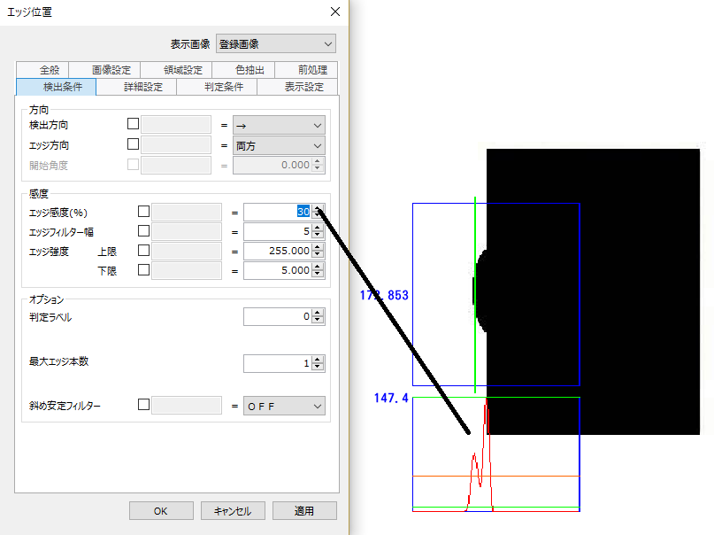
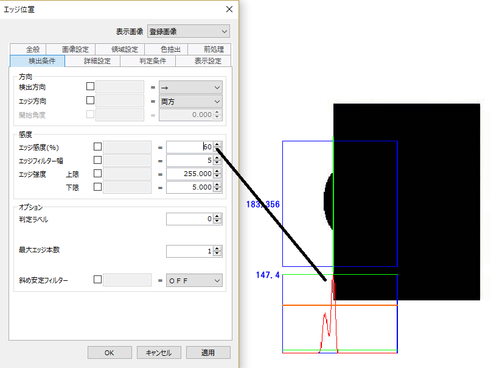
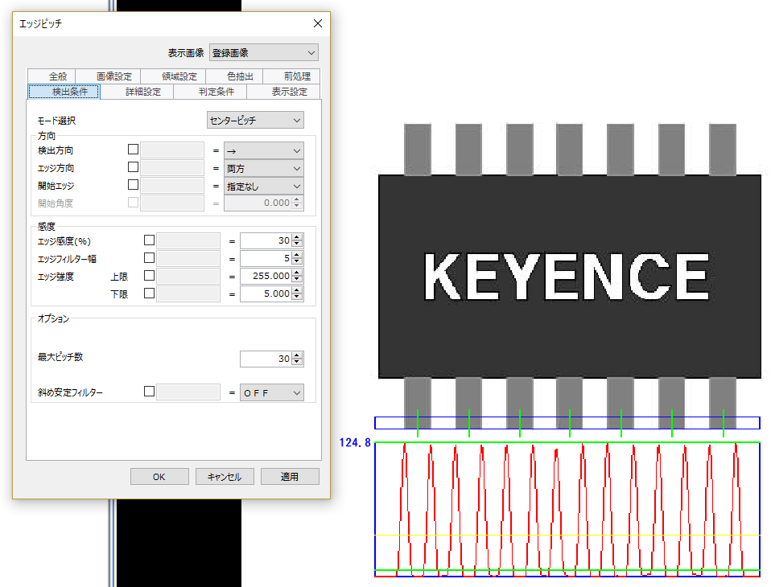

# 画像解析まとめ

## 色抽出
2-489/p527

※マルチスペクトルモード使用時　の参考  
2-495/p533

 

---
## エリア・ユニット
- カメラで撮像した画像を2値化（白黒化）して、白色または黒色の面積を計測できます。

### 検出条件

 

---
## パターンサーチ・ユニット
- 画像パターンをあらかじめ登録しておくことで、入力画像の中から登録パターンにもっとも似ている部分を検出して、パターンの位置や傾き角度、相関値を計測できます。

### 検出条件

 

---
## エッジの検出
### エッジ位置・ユニット (2-90/p128)
- 設定した計測領域内で任意方向にスキャンをおこない、エッジを検出します。  
- エッジ位置計測では、検出エッジの中から指定したエッジの位置を計測します。  
- なお、エッジ検出は濃度の絶対値ではなく変化量によっておこなわれるため、撮像時の照度変動に影響を受けにくい特性があります。  

#### 検出条件
円弧上のエッジを検出したい場合  
開始角度を設定する  
【開始角度】を30度に変更します。計測領域が円周か円弧のときは、位置（座標）ではなく角度を計測します。右の例は先頭文字の角度を求める用途です。**開始角度の初期値が「0」の場合、開始位置は時計でいう3時の位置** です。  
もし3時の位置には文字がかかっていた場合、正しく先頭文字を検出できません。このような場合には、開始角度をずらして文字を避けると、その場所からエッジ検出し、先頭文字を見つける事ができます。  

#### エッジ強度／エッジ感度
2-97/p135  
本システムのエッジ処理は、計測領域内の境界を検出するためのものです。  
エッジ検出は濃度の絶対値ではなく、エッジ検出方向に対して垂直に計測領域内の投影処理をおこなった、平均濃度の変化量によっておこなわれます。  
この変化量のことをエッジ強度と呼びます。  

以下は、エッジ強度を観察しながらエッジ感度を60－＞30に調整した場合の結果

斜めエッジ  
寸法測定6級  

針の先端エッジ  
寸法測定6級  

---
## エッジ幅の計測
### エッジ幅・ユニット (2-99/p137)
- 設定した計測領域内で任意方向にスキャンをおこない、複数のエッジを検出します。  
- エッジ幅計測では、2つのエッジ間の幅を計測します。
- なお、エッジ検出は濃度の絶対値ではなく変化量によっておこなわれるため、撮像時の照度変動に影響を受けにくい特性があります。  

#### 検出条件
- 計測領域が矩形の場合
  - モード選択
    - 外寸
    - 内寸
    - 指定エッジ
- 計測領域が円周／円弧の場合
  - モード選択
    - 外寸
    - 内寸
    - 指定エッジ

#### 詳細設定
- スケーリング補正（2-105/143　寸法5級②）

##### スケーリング補正  
メニュー[オプション] - [スケーリング補正] を選択  
[スケーリング補正設定画面] が開く  
カメラごとにスケール補正を設定する。  

---
## エッジのピッチの計測
### エッジピッチ・ユニット (2-108/p146)
- 設定した計測領域内で任意方向にスキャンをおこない、エッジを検出します。
- エッジピッチ計測では、検出したエッジ間の距離の最大値／最小値や平均値を計測します。  
- なお、エッジ検出は濃度の絶対値ではなく変化量によっておこなわれるため、撮像時の照度変動に影響を受けにくい特性があります。  

#### 検出条件
- モード選択
  - ギャップピッチ
  - センターピッチ

#### モード選択
（寸法測定習得コース4級①）

 

---
## 傷・ユニット
- 2-132/170
- 設定した計測領域内で小面積の検出領域（セグメント）を移動して平均濃度を算出し、しきい値以上の濃度差がある箇所をキズとして検出します。
- 対象物のキズや汚れの有無を検出するときに便利です。
- また、一定以上の濃度差を検出したセグメント群をグループ化して、グループ数やそれぞれの位置を計測（傷グルーピング機能）したり、差分フィルター（2-506ページ）を使用してワークの欠けや汚れを抽出したりすることもできます。

 

---
## ブロブ・ユニット
- 2-145/183
- 2値（白黒）画像内で同一の濃度（255または0）を持った画素の集合を「ブロブ」と呼びます。
- 本機ではブロブの数や、面積や重心位置などの特徴量を計測できます。

 

---
## トレンドエッジ位置・ユニット
- エッジ検出をおこなうセグメントを計測領域内で指定した方向にスキャンして、各セグメントのエッジ位置を計測します。
- 1つの計測領域の中で複数のエッジ位置情報を計測できるので、全体の平均や最大、最小に加えて、個別の計測結果や全検出位置を点群とする円や直線を検出できます。  

### 検出条件
- エッジ位置と同様。トレンドエッジ位置とはエッジ位置を小さいセグメントに分けて複数回実行する検査。  
- セグメントサイズ（単位：画素）検査領域内でエッジ検出をする小領域  
- 移動量（単位：画素）検査領域内でセグメントを配置する際のずらし量  
- 円／直線検出は ...  
  - 直線：検査領域が **矩形　回転矩形** の場合
  - 円：検査領域が **円周　円弧** の場合
- 変形補正
  - ONの場合
    - 【異常点乖離量許容値】【異常点サイズ上限】の設定が有効となり、この条件を満たす点だけを使って直線を求めます。窪みの影響が少なくなり、ワークに沿った直線となったことを確認します。
    - 異常点乖離量許容値（単位：画素）隣のエッジ点との差が大きすぎた場合異常とする。（変形補正ONのみ有効）
    - 異常点サイズ上限（単位：％）エッジ検出点数を100％として、異常とみなす連続するエッジ点数を割合として設定する。（変形補正ONのみ有効）

 

---
## トレンドエッジ幅・ユニット
- 2-180/218 寸法測定習得コース2級
  - ワークの最大値、最小値を検出条件の判定ラベル（最大／最小）を求めて実行
- エッジ検出をおこなうセグメントを計測領域内で指定した方向にスキャンして、各セグメント内におけるエッジ間の幅を計測します。
- 1つの計測領域の中で複数の幅情報を計測できるので、平均や最大、最小、または個別の計測結果を求めることができます。
- **その他のパラメータは、エッジ位置、トレンドエッジ位置と同様**

### 検出条件
- 設定項目
  - 設定項目A
  - 設定項目A

#### 設定項目A　のメモ

 

---
## トレンドエッジ欠陥・ユニット
- トレンドエッジ位置（2-168ページ）と同じ処理により得られた複数のエッジ位置情報から、検査対象の輪郭となる基準モデル線（直線または円、楕円、自由曲線）を算出し、基準モデル線に対してしきい値を超える、形状的に変化の大きい箇所（突起や凹み）を欠陥として検出します。
- 欠陥レベル（欠陥の高さ、深さ方向）および欠陥セグメント数（欠陥の幅方向）、欠陥量（欠陥の大きさ）、欠陥の位置、欠陥数を計測結果として求めることができます。

### 検出条件
- 設定項目
  - 設定項目A
  - 設定項目A

 

---
## ShapeTrax2・ユニット
- 2-68/106
- 登録された画像パターンと入力画像から得られるエッジ情報を比較することで、最も相似した場所を検出してパターンの位置や傾き角度、相関値を計測できます。
- 対象の輪郭を主としたエッジ情報を参照する点でパターンサーチ（2-46ページ）と異なり、対象の表面状態変動や欠損に対する精度、安定度を求められる位置検出に適しています。

### 検出条件
- 角度範囲
  - パターンが回転している場合に、計測する角度の範囲を－179.999°～180.000°までの間で指定します。

---
## XXX・ユニット
XXX  

### 検出条件
- 設定項目
  - 設定項目A
  - 設定項目A

#### 設定項目A　のメモ
